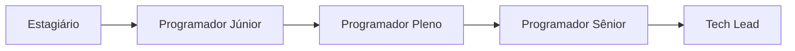
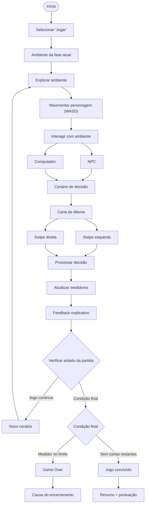
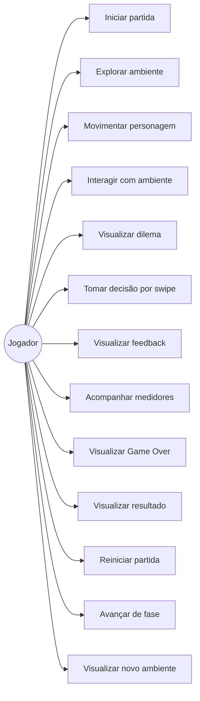
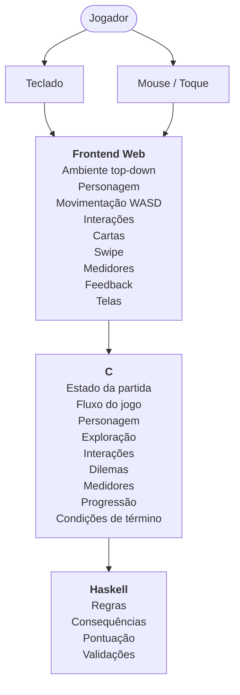
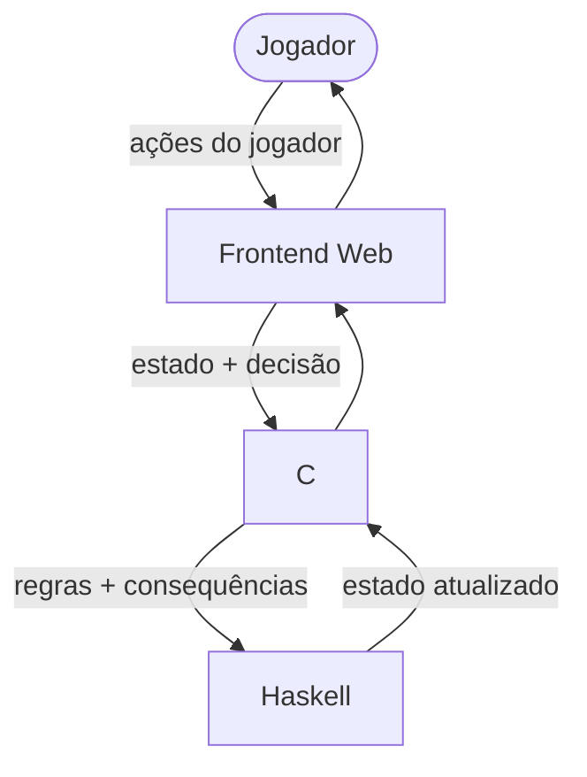
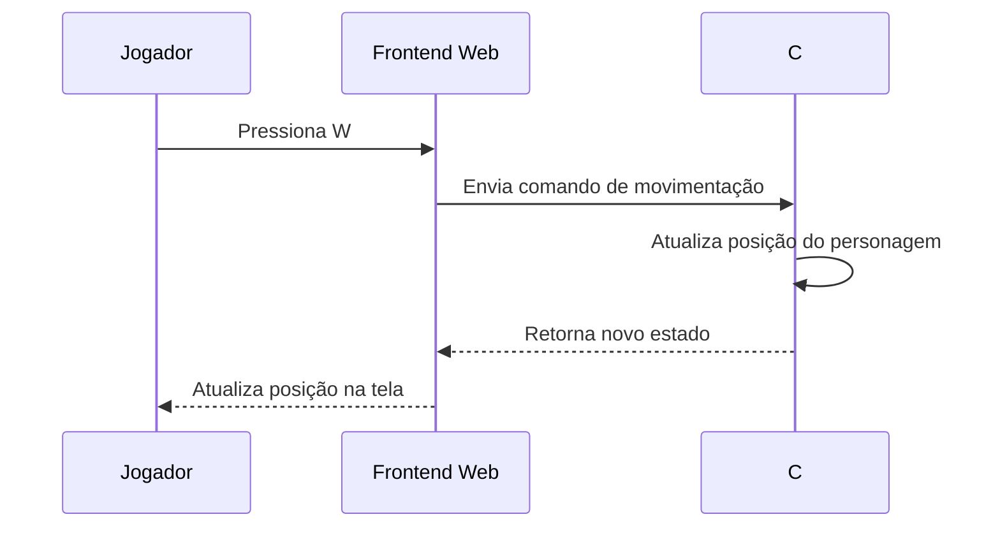
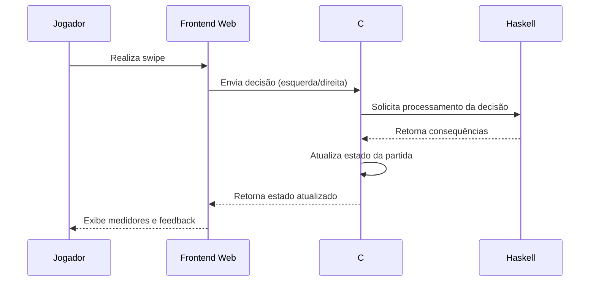
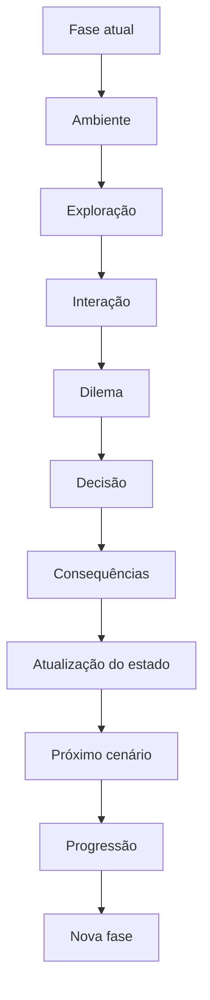

# Documento de Fundamentos de Desenvolvimento de Software — Decifra.IA

---

## 1. Requisitos Funcionais

> Os requisitos funcionais definem os comportamentos e funcionalidades.

### 1.1 "Requisitos funcionais"

| ID | Requisito | Descrição | Prioridade |
|:--:|-----------|-----------|:----------:|
| `RF01` | **Iniciar partida** | O sistema deve permitir que o jogador selecione "Jogar" e inicie uma nova partida. | Must Have |
| `RF02` | **Apresentar ambiente** | O sistema deve apresentar o ambiente correspondente à fase atual do jogador. | Must Have |
| `RF03` | **Explorar ambiente** | O sistema deve permitir que o jogador explore o ambiente utilizando uma perspectiva top-down. | Must Have |
| `RF04` | **Movimentar personagem** | O sistema deve permitir que o jogador movimente o personagem utilizando as teclas **WASD**. | Must Have |
| `RF05` | **Interagir com ambiente** | O sistema deve permitir que o jogador interaja com elementos relevantes do ambiente, como NPCs e computadores. | Must Have |
| `RF06` | **Apresentar cenário de decisão** | O sistema deve apresentar um cenário de decisão após determinadas interações com o ambiente. | Must Have |
| `RF07` | **Apresentar dilema** | O sistema deve apresentar dilemas relacionados a situações de IA, incluindo temas como viés, alucinação, privacidade e dependência. | Must Have |
| `RF08` | **Apresentar alternativas** | O sistema deve apresentar duas alternativas de postura diante do dilema apresentado. | Must Have |
| `RF09` | **Realizar decisão por swipe** | O sistema deve permitir que o jogador arraste a carta de decisão para a esquerda ou direita para selecionar uma das alternativas. | Must Have |
| `RF10` | **Processar decisão** | O sistema deve processar a alternativa escolhida e aplicar suas consequências ao estado da partida. | Must Have |
| `RF11` | **Atualizar medidores** | O sistema deve atualizar os medidores de **Confiança**, **Privacidade**, **Lucro** e **Viés** após uma decisão. | Must Have |
| `RF12` | **Apresentar feedback** | O sistema deve apresentar um feedback explicativo sobre a decisão realizada e suas consequências. | Must Have |
| `RF13` | **Continuar ciclo de jogo** | O sistema deve permitir que o jogador continue para novos cenários após o processamento de uma decisão. | Must Have |
| `RF14` | **Verificar condição de término** | O sistema deve verificar se algum medidor atingiu uma condição de término ou se não existem mais cartas disponíveis. | Must Have |
| `RF15` | **Apresentar Game Over** | Quando um dos medidores zerar ou ultrapassar seu limite, o sistema deve encerrar a partida e apresentar uma mensagem correspondente à causa. | Must Have |
| `RF16` | **Apresentar resultado** | Ao completar o jogo, o sistema deve apresentar uma tela de resumo com a pontuação final. | Must Have |
| `RF17` | **Reiniciar partida** | O sistema deve permitir que o jogador reinicie uma partida após seu encerramento. | Should Have |
| `RF18` | **Apresentar conteúdos educativos** | O sistema deve apresentar conteúdos explicativos relacionados aos conceitos de IA abordados durante o jogo. | Should Have |
| `RF19` | **Apresentar eventos adicionais** | O sistema deve permitir a ocorrência de eventos adicionais durante a partida, ampliando as situações enfrentadas pelo jogador. | Should Have |
| `RF20` | **Apresentar múltiplos finais** | O sistema deve apresentar diferentes resultados finais de acordo com as decisões e condições alcançadas durante a partida. | Should Have |
| `RF21` | **Controlar progressão de carreira** | O sistema deve permitir que o jogador avance por diferentes fases de carreira conforme progride no jogo. | Should Have |
| `RF22` | **Desbloquear novas fases** | O sistema deve permitir o desbloqueio de novas fases conforme os critérios de progressão definidos. | Should Have |
| `RF23` | **Apresentar ambientes por fase** | O sistema deve apresentar o ambiente correspondente à fase de carreira atual. | Should Have |

### "Progressão de carreira"

> A progressão de carreira prevista inicialmente será composta por diferentes etapas, partindo de **Estagiário** e avançando progressivamente para cargos de maior responsabilidade.

### 1.2 "Fluxo funcional geral"

> O fluxo principal do jogo ocorre por meio de um ciclo de **exploração, interação e tomada de decisão**.

> O ciclo se repete enquanto houver novos cenários e nenhum dos medidores atingir uma condição de encerramento.

---

## 2. Requisitos Não Funcionais

> Os requisitos não funcionais definem características, restrições e condições técnicas que deverão ser consideradas na implementação do sistema.

| ID | Categoria | Requisito |
|:--:|-----------|-----------|
| `RNF01` | **"Plataforma"** | O jogo deve ser implementado como uma aplicação **Web**. |
| `RNF02` | **"Interface"** | O sistema deve possuir uma interface visual para apresentar o ambiente, personagem, cartas, medidores, feedbacks e telas de resultado. |
| `RNF03` | **"Responsividade"** | A interface deve ser adaptável aos diferentes tamanhos de tela dos dispositivos suportados. |
| `RNF04` | **"Desktop"** | A aplicação deve oferecer suporte à execução em computadores desktop por meio de navegador. |
| `RNF05` | **"Mobile"** | A interface deve considerar a execução em dispositivos móveis, principalmente para as interações compatíveis com toque. |
| `RNF06` | **"Entrada"** | O sistema deve aceitar teclado para movimentação do personagem e mouse ou toque para as interações da interface. |
| `RNF07` | **"Swipe"** | A mecânica de arrastar a carta deve funcionar de maneira consistente nas formas de interação suportadas. |
| `RNF08` | **"Compatibilidade"** | A aplicação deve funcionar em navegadores compatíveis com as tecnologias utilizadas no desenvolvimento. |
| `RNF09` | **"Modularidade"** | O sistema deve ser dividido em componentes com responsabilidades bem definidas. |
| `RNF10` | **"Separação de responsabilidades"** | A interface, o gerenciamento do estado e as regras do jogo devem possuir responsabilidades separadas. |
| `RNF11` | **"Testabilidade"** | As principais regras e comportamentos do sistema devem ser estruturados de maneira que possam ser testados. |
| `RNF12` | **"Tecnologia"** | O projeto não deverá utilizar uma engine de jogos. |
| `RNF13` | **"Arquitetura"** | A solução deverá utilizar **Frontend Web**, **C** e **Haskell**, com comunicação entre os componentes. |
| `RNF14` | **"Backend"** | O jogo não deverá depender de um backend próprio para seu funcionamento principal. |
| `RNF15` | **"Usabilidade"** | O jogador deve conseguir compreender o fluxo básico de exploração, interação e decisão por meio da interface. |
| `RNF16` | **"Consistência"** | Uma mesma decisão, considerando o mesmo estado da partida, deve produzir as mesmas consequências de acordo com as regras definidas. |

---

## 3. Modelagem

> A modelagem representa as principais interações entre o jogador e o sistema, além do fluxo necessário para executar uma partida.

### 3.1 "Ator"

O sistema possui como ator principal o **Jogador**.

O jogador é responsável por:

- Iniciar uma partida
- Controlar o personagem
- Explorar o ambiente
- Interagir com NPCs e computadores
- Visualizar dilemas
- Tomar decisões
- Acompanhar os medidores
- Visualizar feedbacks
- Avançar entre fases
- Visualizar o resultado da partida
- Reiniciar o jogo

### 3.2 "Diagrama de Casos de Uso"

### 3.3 Descrição dos principais casos de uso

<b>UC01 — Iniciar partida</b>

**Ator:** Jogador

**Descrição:** Permite iniciar uma nova partida.

**Fluxo:**

1. O jogador seleciona a opção "Jogar".
2. O sistema inicializa o estado da partida.
3. O sistema apresenta o ambiente correspondente à fase atual.
4. O jogador pode iniciar a exploração.

<b>UC02 — Explorar ambiente</b>

**Ator:** Jogador

**Descrição:** Permite que o jogador percorra o ambiente da fase atual em perspectiva top-down.

**Fluxo:**

1. O sistema apresenta o ambiente.
2. O jogador movimenta o personagem utilizando WASD.
3. O jogador percorre o ambiente.
4. O jogador identifica elementos com os quais pode interagir.

<b>UC03 — Movimentar personagem</b>

**Ator:** Jogador

**Descrição:** Permite controlar a movimentação do personagem.

**Fluxo:**

1. O jogador pressiona uma das teclas WASD.
2. O Frontend identifica a entrada.
3. O estado do personagem é atualizado.
4. A posição visual do personagem é atualizada.

<b>UC04 — Interagir com ambiente</b>

**Ator:** Jogador

**Descrição:** Permite que o jogador interaja com elementos relevantes do ambiente.

As interações poderão ocorrer, por exemplo, com:

- `NPCs`
- `Computadores`
- `Outros elementos definidos para cada fase`

> Uma interação válida pode desencadear um cenário de decisão.

<b>UC05 — Visualizar dilema</b>

**Ator:** Jogador

**Descrição:** Após determinada interação, o sistema apresenta um cenário relacionado a um dilema de Inteligência Artificial.

Os temas previstos incluem:

- `Viés`
- `Alucinação`
- `Privacidade`
- `Dependência`

<b>UC06 — Tomar decisão por swipe</b>

**Ator:** Jogador

**Descrição:** Permite selecionar uma das duas posturas apresentadas no dilema por meio do arraste da carta.

**Fluxo:**

1. O jogador visualiza a carta.
2. O jogador analisa as duas alternativas.
3. O jogador arrasta a carta para a esquerda ou direita.
4. O sistema identifica a direção.
5. A alternativa correspondente é selecionada.
6. A decisão é encaminhada para processamento.

<b>UC07 — Visualizar feedback</b>

**Ator:** Jogador

**Descrição:** Após uma decisão, o sistema apresenta uma explicação relacionada à escolha realizada e às suas consequências.

<b>UC08 — Acompanhar medidores</b>

**Ator:** Jogador

**Descrição:** O sistema apresenta o estado dos quatro medidores:

- `Confiança`
- `Privacidade`
- `Lucro`
- `Viés`

> Os valores são alterados conforme as decisões tomadas durante a partida.

<b>UC09 — Visualizar Game Over</b>

**Ator:** Jogador

**Descrição:** O sistema encerra a partida quando um dos medidores atingir uma condição de término.

> A tela de Game Over deverá apresentar uma mensagem relacionada à causa do encerramento.

<b>UC10 — Visualizar resultado</b>

**Ator:** Jogador

**Descrição:** Caso o jogador conclua a partida, o sistema apresenta um resumo contendo a pontuação final e o resultado alcançado.

<b>UC11 — Reiniciar partida</b>

**Ator:** Jogador

**Descrição:** Permite iniciar uma nova partida após o encerramento da partida atual.

<b>UC12 — Avançar de fase</b>

**Ator:** Jogador

**Descrição:** Permite que o jogador avance para novas etapas da progressão de carreira conforme os critérios definidos pelo jogo.

---

## 4. Esboço de Arquitetura

A arquitetura do Decifra.IA será organizada em três componentes principais:

- **"Frontend Web"**: apresentação visual e interação com o jogador
- **"C"**: gerenciamento do estado e fluxo principal do jogo
- **"Haskell"**: processamento das regras e consequências

### 4.1 "Visão geral"

### 4.2 "Frontend Web"

> Responsável pela camada de apresentação e pela interação direta com o jogador.
**Responsabilidades:**
- Apresentar o ambiente de cada fase
- Apresentar o personagem
- Capturar comandos de movimentação
- Permitir movimentação utilizando WASD
- Apresentar elementos interativos
- Apresentar NPCs e computadores
- Iniciar as telas de dilema
- Apresentar cartas de decisão
- Implementar o swipe para esquerda e direita
- Apresentar os quatro medidores
- Apresentar feedbacks
- Apresentar eventos
- Apresentar telas de Game Over
- Apresentar o resumo final
- Apresentar a progressão entre fases
- Adaptar a interface aos dispositivos suportados

### 4.3 "C"

> Responsável pelo gerenciamento do estado e pelo fluxo principal da partida.
**Responsabilidades:**
- Controlar o estado atual do jogo
- Controlar o estado e a posição do personagem
- Controlar a exploração
- Processar interações relevantes
- Controlar a sequência dos cenários
- Controlar as cartas disponíveis
- Receber as decisões realizadas pelo jogador
- Controlar os quatro medidores
- Verificar condições de término
- Controlar a progressão de carreira
- Controlar o fluxo entre exploração e tomada de decisão
- Comunicar-se com Haskell para processamento das regras

### 4.4 "Haskell"

> Utilizado para concentrar as regras relacionadas ao processamento das decisões.
**Responsabilidades:**
- Processar as regras dos dilemas
- Determinar consequências das escolhas
- Calcular pontuações
- Realizar validações
- Auxiliar na determinação dos resultados
- Processar regras necessárias para os diferentes finais

### 4.5 "Integração entre os componentes"
**Fluxo geral de comunicação:**

**Exemplo — durante a exploração:**

**Exemplo — durante uma decisão:**

### 4.6 "Arquitetura e progressão do jogo"

> A arquitetura deverá permitir que o mesmo fluxo básico seja reutilizado nas diferentes fases de carreira.

> Dessa forma, a progressão de **Estagiário Júnior Pleno Sênior Tech Lead** poderá utilizar a mesma estrutura arquitetural, alterando principalmente os ambientes, cenários, dilemas e conteúdos associados a cada fase.

---

