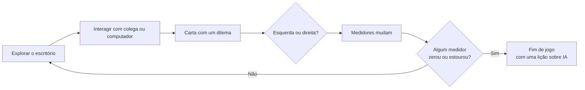
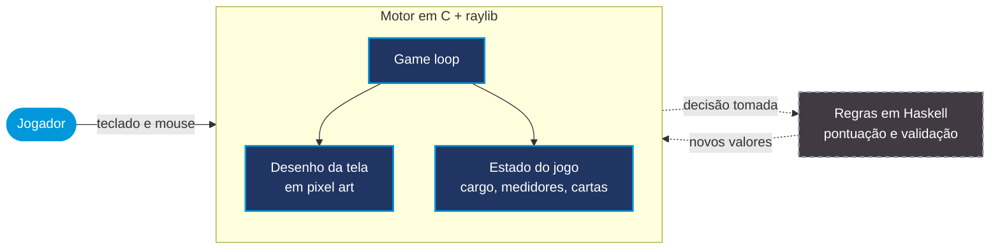

<h3 align="center">
    Você começa como estagiário numa empresa de tecnologia.
  A IA está em todo lugar. O que você faz com ela é escolha sua.
</h3>

<p align="center">
  
  
  
  
</p>

---

## Sobre 

O **else** é um jogo educativo sobre letramento em Inteligência Artificial. Você entra numa empresa de tecnologia como estagiário e, a cada fase, sobe um degrau na carreira até chegar a Tech Líder. Pelo caminho, a IA aparece em cada canto do escritório: na triagem de currículos, no relatório que ninguém revisou, no chatbot que atende os clientes. E é você quem decide quando usar, quando questionar e quando dizer não.

## Os quatro pilares 
Cada decisão mexe com quatro coisas ao mesmo tempo, e elas aparecem como medidores na tela durante todo o jogo.

| Pilar | A pergunta por trás |
|---|---|
| **Confiança** | Depois dessa decisão, as pessoas ainda acreditam em você e na empresa? |
| **Lucro** | Quanto vale ganhar mais se o custo cai em cima de alguém? |
| **Privacidade** | Que dados das pessoas você está entregando pra uma IA sem perceber? |
| **Viés** | A IA está tratando todo mundo do mesmo jeito? |

## Como o jogo funciona
Você explora o escritório em visão de cima, no estilo dos RPGs clássicos de 16 bits. Quando conversa com um colega ou usa um computador, surge uma carta com um dilema. Arraste pra esquerda ou pra direita pra decidir, e veja os medidores reagirem na hora.


Se qualquer medidor chegar a 0 ou a 100, o jogo acaba. E cada final explica o que deu errado e o que isso ensina sobre IA no mundo real. Equilíbrio é tudo: lucro demais custa confiança, privacidade demais trava a empresa.

## Arquitetura

O jogo é dividido em duas camadas, cada uma com uma responsabilidade clara.



| Camada | Tecnologia | O que faz |
|---|---|---|
| Motor e visual | C + [raylib](https://www.raylib.com/) | Game loop, leitura de teclado e mouse, desenho das telas e controle do estado do jogo |
| Regras | Haskell | Cálculo de pontuação e validação das regras, com funções puras (Unidade 2) |

### Por que essas escolhas

- **C** é requisito do projeto, e engines comerciais (como Unity ou Godot) não são permitidas. O desafio era ter um jogo visual sem sair do C.
- **raylib** resolve isso: é uma biblioteca gráfica leve, feita pra C, que permite desenhar sprites, tocar sons e ler o teclado sem esconder a lógica do jogo atrás de uma engine.
- **Haskell** cuida das regras porque funções puras sempre dão o mesmo resultado pra mesma entrada. Isso torna a pontuação previsível e fácil de testar.

---
## Como rodar

Baixe ou clone o repositório e abra o `jogo.exe` a partir da pasta do projeto (Windows).

<details>
<summary><b>Quero mexer no código</b></summary>

<br>

1. Instale o [MSYS2](https://www.msys2.org/) em `C:\msys64` e, no terminal **MSYS2 UCRT64**, rode:
```
   pacman -Syu
   pacman -S mingw-w64-ucrt-x86_64-gcc mingw-w64-ucrt-x86_64-raylib
```
2. Abra a pasta do projeto no VS Code e confira o compilador com `gcc --version`
3. Compile e rode com `.\jogar.bat`

Deu problema? O [Guia Rápido](./Guia_Rapido_ExecutarJogo.md) resolve os erros mais comuns.

</details>

<details>
<summary><b>Estrutura do projeto</b></summary>

<br>

```
else/
├── Code/              # código-fonte em C
├── cenario/           # imagens dos escritórios
├── Botoes/            # sprites dos botões
├── assets/            # demais imagens do jogo
├── musicas/           # trilhas sonoras
├── EfeitosSonoros/    # sons de interface
├── Documentação/      # documentos de engenharia de software
├── jogar.bat          # compila e abre o jogo
└── jogo.exe           # última versão compilada
```

</details>

---


Toda a documentação de engenharia de software está disponível na pasta [`/docs`](./docs):

| Documento | Descrição |
|---|---|
| [Visão](./docs/visao.md) | Propósito, escopo e stakeholders do produto |
| [Requisitos](./docs/requisitos.md) | Requisitos funcionais, não-funcionais e restrições |
| [Histórias de Usuário](./docs/historias-usuario.md) | 15+ histórias no padrão 3Cs (Card, Conversation, Confirmation) |
| [Modelagem](./docs/modelagem.md) | Diagrama e descrição de casos de uso |
| [Arquitetura](./docs/arquitetura.md) | Componentes do sistema e decisões técnicas |
| [Processo](./docs/processo.md) | Metodologia, papéis e fluxo de trabalho da equipe |
| [Testes](./docs/testes.md) | Estratégias, tipos de teste e critérios de aceite |

---

## 📋 Gestão do projeto

Sprints, backlog e tarefas é feito no board do Jira:

🔗 [Board do projeto (Jira)](https://algs2.atlassian.net/jira/software/c/projects/PI2E8/boards/8)

---

## Entrega 02: Modelagem e Prototipação

**Solução de prototipação escolhida:** Storyboard

### Demonstração

> [🎬 Screencast com áudio e legendas](youtube.com/watch?feature=shared&v=sPg2rsm8cXE)

### Modelagem e Prototipação

| Artefato | Onde encontrar |
|---|---|
| Diagramas de atividade | [FigJam](https://www.figma.com/board/3xdh1WRdeCV1OWxPhDDmk0) |
| Storyboards | [Figma](https://www.figma.com/design/jk3QiWfnkW9yzDmboFz8R9/Storyboards-Else) |
| Wireframes das telas | [FigJam](https://www.figma.com/board/KysbFg6xFmuL41d14R8jWr) |  

<details>
<summary><b>Rastreabilidade por história de usuário</b></summary>

<br>

| História | Diagrama de atividade | Storyboard |
|---|---|---|
| US01: Iniciar uma nova partida | [ver](https://www.figma.com/board/3xdh1WRdeCV1OWxPhDDmk0/US01---Iniciar-uma-nova-partida?node-id=72-563) | [ver](https://www.figma.com/design/jk3QiWfnkW9yzDmboFz8R9/Storyboards-Else?node-id=88-20) |
| US02: Tomar uma decisão e ver o impacto | [ver](https://www.figma.com/board/3xdh1WRdeCV1OWxPhDDmk0/US01---Iniciar-uma-nova-partida?node-id=72-564) | [ver](https://www.figma.com/design/jk3QiWfnkW9yzDmboFz8R9/Storyboards-Else?node-id=88-21) |
| US03: HUD de medidores éticos | [ver](https://www.figma.com/board/3xdh1WRdeCV1OWxPhDDmk0/US01---Iniciar-uma-nova-partida?node-id=72-565) | [ver](https://www.figma.com/design/jk3QiWfnkW9yzDmboFz8R9/Storyboards-Else?node-id=88-22) |
| US04: Interagir com cards de decisão | [ver](https://www.figma.com/board/3xdh1WRdeCV1OWxPhDDmk0/US01---Iniciar-uma-nova-partida?node-id=72-566) | [ver](https://www.figma.com/design/jk3QiWfnkW9yzDmboFz8R9/Storyboards-Else?node-id=88-23) |
| US06: Núcleo da IA reage ao estado do jogo | [ver](https://www.figma.com/board/3xdh1WRdeCV1OWxPhDDmk0/US01---Iniciar-uma-nova-partida?node-id=72-575) | não se aplica |
| US07: Receber notificações inesperadas | [ver](https://www.figma.com/board/3xdh1WRdeCV1OWxPhDDmk0/US01---Iniciar-uma-nova-partida?node-id=72-576) | [ver](https://www.figma.com/design/jk3QiWfnkW9yzDmboFz8R9/Storyboards-Else?node-id=88-31) |
| US08: Aprender um conceito de IA após a decisão | [ver](https://www.figma.com/board/3xdh1WRdeCV1OWxPhDDmk0/US01---Iniciar-uma-nova-partida?node-id=72-577) | [ver](https://www.figma.com/design/jk3QiWfnkW9yzDmboFz8R9/Storyboards-Else?node-id=88-24) |
| US09: Progressão entre escritórios de carreira | [ver](https://www.figma.com/board/3xdh1WRdeCV1OWxPhDDmk0/US01---Iniciar-uma-nova-partida?node-id=72-578) | [ver](https://www.figma.com/design/jk3QiWfnkW9yzDmboFz8R9/Storyboards-Else?node-id=88-27) |
| US10: Conjunto mínimo de cartas de decisão | [ver](https://www.figma.com/board/3xdh1WRdeCV1OWxPhDDmk0/US01---Iniciar-uma-nova-partida?node-id=72-579) | não se aplica |
| US11: Revisar decisões passadas em auditoria | [ver](https://www.figma.com/board/3xdh1WRdeCV1OWxPhDDmk0/US01---Iniciar-uma-nova-partida?node-id=72-580) | não se aplica |
| US12: Tela de fim de jogo | [ver](https://www.figma.com/board/3xdh1WRdeCV1OWxPhDDmk0/US01---Iniciar-uma-nova-partida?node-id=72-581) | [ver](https://www.figma.com/design/jk3QiWfnkW9yzDmboFz8R9/Storyboards-Else?node-id=88-28) |
| US13: Reiniciar a partida | [ver](https://www.figma.com/board/3xdh1WRdeCV1OWxPhDDmk0/US01---Iniciar-uma-nova-partida?node-id=72-582) | [ver](https://www.figma.com/design/jk3QiWfnkW9yzDmboFz8R9/Storyboards-Else?node-id=88-29) |
| US14: Executar o jogo no computador | [ver](https://www.figma.com/board/3xdh1WRdeCV1OWxPhDDmk0/US01---Iniciar-uma-nova-partida?node-id=72-583) | não se aplica |
| US15: Compartilhar o resultado final | [ver](https://www.figma.com/board/3xdh1WRdeCV1OWxPhDDmk0/US01---Iniciar-uma-nova-partida?node-id=72-584) | [ver](https://www.figma.com/design/jk3QiWfnkW9yzDmboFz8R9/Storyboards-Else?node-id=88-30) |

</details>


